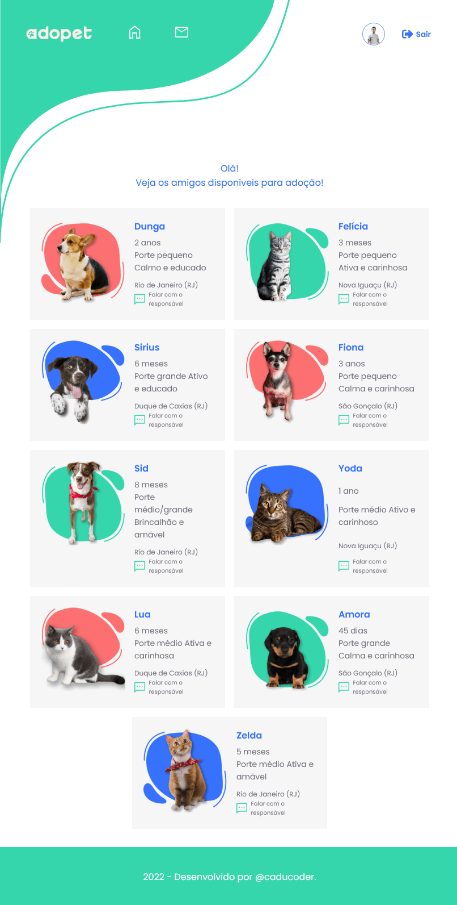
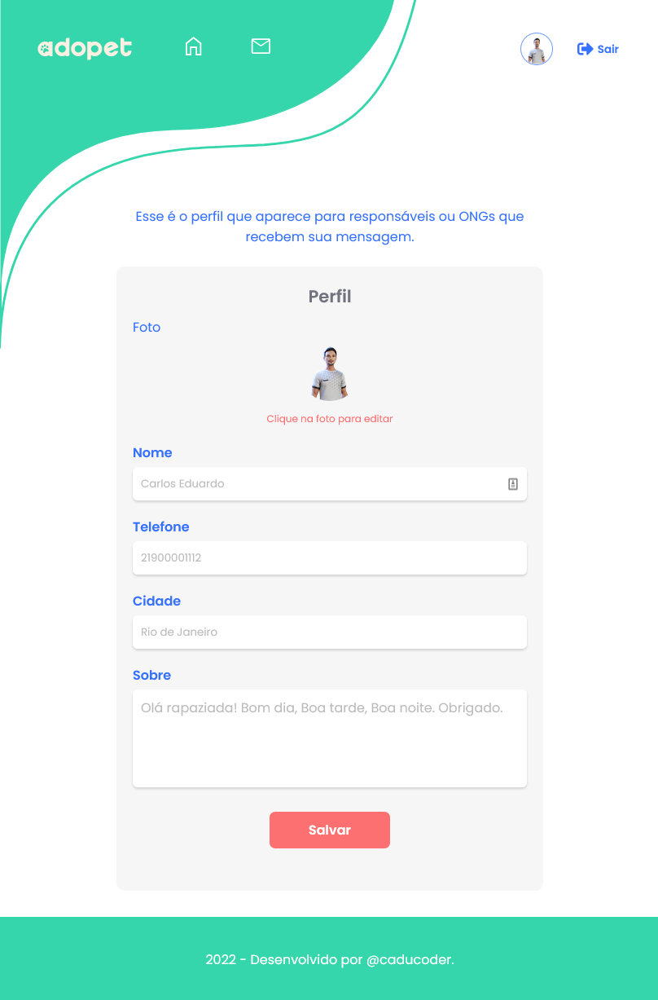

<div id="top"></div>

<div align="center">

[![Designed-by]][Alura-url] 
[![Built-by]][Caducoder-url] 

</div>

<!-- PROJECT LOGO -->
<br />
<div align="center">
  <a href="https://github.com/github_username/repo_name">
    
  </a>

<h3 align="center">Adopet</h3>

  <p align="center">
    Website para adoção de animais.
    <br />
    <a href="https://github.com/github_username/repo_name"><strong>Clique aqui para ver o projeto!</strong></a>
    <br />
  </p>
</div>

<!-- ABOUT THE PROJECT -->
## 📋 Sobre o Projeto


Website construído com a finalidade de ser um portal em que pessoas podem adotar pets de uma ONG que foram resgatados da rua.

### :hammer_and_wrench: Tecnologias utilizadas

* [![React.js]][React-url]
* [![Typescript]][Typescript-url]
* [![Sass]][Sass-url]
* [![Firebase]][Firebase-url]


<!-- GETTING STARTED -->
## :beginner: Getting Started

Para obter uma cópia local do projeto rodando, siga estes passos.

### Pré-requisitos

Caso não tenha o npm instalado, use este comando:

* npm
  ```sh
  npm install npm@latest -g
  ```

### Instalação

1. Clone o repositório
   ```bash
   git clone https://github.com/github_username/repo_name.git
   ```
2. Instale os pacotes NPM
   ```bash
   npm install
   ```
3. Rode o projeto
   ```bash
    npm run dev
   ```


<!-- USAGE EXAMPLES -->
## :desktop_computer: Utilização

Você pode usar o email: user@gmail.com e senha: adminuser, caso não queira criar uma conta.




<!-- ROADMAP -->
## 💫 Funcionalidades

- [x] Login com email e senha
- [x] Cadastro de novos usuários
- [x] Envio de mensagem
- [x] Customização do perfil
- [ ] Login persistente no localStorage.


<!-- CONTRIBUTING -->
## :rocket: Contribuindo

As contribuições são o que tornam a comunidade de código aberto um lugar incrível para aprender, inspirar e criar. Quaisquer contribuições que você fizer são **muito apreciadas**

Se você tem uma sugestão para melhorar o projeto, fork o repositório e crie um pull request. Você pode também abrir uma issue com a tag "melhoria". Não esqueça de dar uma estrela ao projeto! Muito obrigado!

1. Fork o projeto
2. Cria sua branch (`git checkout -b feature/AmazingFeature`)
3. Commit suas alterações (`git commit -m 'Add some AmazingFeature'`)
4. Faça o push da branch (`git push origin feature/AmazingFeature`)
5. Abra um Pull Request

<!-- CONTACT -->
## :speech_balloon: Contato

Your Name - [@twitter_handle](https://twitter.com/twitter_handle) - email@email_client.com

Project Link: [https://github.com/github_username/repo_name](https://github.com/github_username/repo_name)


<!-- ACKNOWLEDGMENTS -->
## :bulb: Dicas

Pacotes e plugins que me ajudaram bastante. Aqui estão meus favoritos:

* [Formik](https://formik.org/)
* [Yup](https://www.npmjs.com/package/yup)
* [React Icons](https://react-icons.github.io/react-icons/)
* [React Router Dom](https://reactrouter.com/)
* [React Toastify](https://fkhadra.github.io/react-toastify/introduction)

<p align="right">(<a href="#top">:arrow_up: Topo</a>)</p>
<hr>
<div align="center">

[![Built-with]][Badge-url]

</div>


<!-- MARKDOWN LINKS & IMAGES -->

[React.js]: https://img.shields.io/badge/React-20232A?style=for-the-badge&logo=react&logoColor=61DAFB
[React-url]: https://reactjs.org/
[Typescript]: https://img.shields.io/badge/TypeScript-007ACC?style=for-the-badge&logo=typescript&logoColor=white
[Typescript-url]: https://www.typescriptlang.org/
[Sass]: https://img.shields.io/badge/Sass-CC6699?style=for-the-badge&logo=sass&logoColor=white
[Sass-url]: https://sass-lang.com/
[Firebase]: https://img.shields.io/badge/firebase-ffca28?style=for-the-badge&logo=firebase&logoColor=black
[Firebase-url]: https://firebase.google.com/?hl=pt
[Built-with]: https://forthebadge.com/images/badges/built-with-love.svg
[Badge-url]: https://forthebadge.com/
[Designed-by]: ./src/assets/designed-by-alura.svg
[Alura-url]: https://www.alura.com.br/
[Built-by]: ./src/assets/built-by-caducoder.svg
[Caducoder-url]: https://github.com/caducoder
